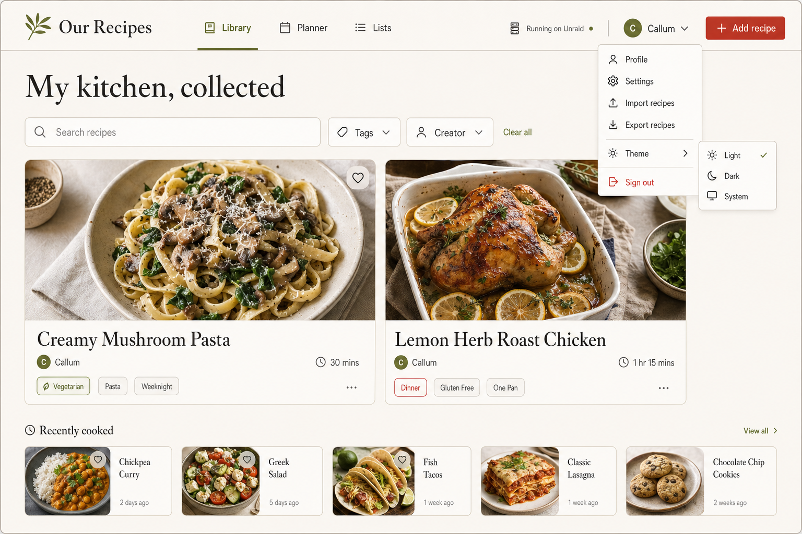

# Our Recipes visual specification

## Intent

Our Recipes should feel like a well-used kitchen notebook: warm, practical, personal, and calm. It is deliberately not a generic SaaS dashboard. The first-run screen turns an empty installation into a shared place while clearly stating the local-network trust boundary.

## Foundations

- **Palette:** linen `#F7F3EA` and off-white `#FFFDF8` are the paper; ink `#273126` is the reading color; leaf `#637A45` signals household continuity; tomato `#A85032` is reserved for the one primary action; muted clay and butter may support illustration.
- **Type:** Georgia (or the system serif fallback) is used for recipe-like editorial headings. The system sans stack carries controls, labels, API states, and dense utility text.
- **Surface:** subtle paper texture, fine warm-gray rules, modest rounded corners, and soft downward shadows. No purple gradients, metric cards, bento dashboards, or artificial data visualizations.
- **Motion:** only short hover/focus transitions. Reduced-motion users receive effectively static UI.

## First-run flow

The page has a story-first left panel and a task-focused form card on the right at desktop widths. The left panel includes the product mark, a conversational “Make this kitchen yours” headline, a small plant illustration, and the visible non-auth warning. The right card is a single clear step:

1. household and displayed app name;
2. first profile name, color, units, temperature, locale, and timezone;
3. a single tomato-colored “Open the cookbook” submission action.

Every input has a persistent label, keyboard focus treatment, inline validation, and no placeholder-only instructions. On mobile the story panel becomes a short top panel and the card overlaps it slightly; two-column form groups collapse to one column.

## Established-home flow

The initial established-home screen uses a quiet centered masthead, a small text navigation, and a profile switcher. Its hero greets the active profile and makes the next unimplemented capability explicit rather than presenting fake recipes or disabled-looking metrics as real data. A green trust card keeps the “profiles are not security” boundary visible. Three editorial cards outline the upcoming recipe library, planner, and shopping-list domains without pretending they are populated.

## Recipe-photo surface

Recipe photos sit beneath the recipe introduction in a warm, bounded gallery rather than becoming a dashboard asset. The first row pairs the editorial “A little visual memory” heading with the saved count. Each image uses a stable 4:3 crop and retains an adjacent text description plus a clearly labeled removal control. The add-photo form stays on the same surface so the local-only constraint remains visible. On narrow screens the header actions remain compact, the gallery becomes a single column, and the form fields stack without clipping.

## Offline fallback

The offline fallback is a calm, centered kitchen-note surface rather than a browser error. It explains that previously opened recipes remain readable but makes no promise that an uncached recipe, a new change, or a plan/list update has been saved. The message and retry link use the established editorial palette and retain visible keyboard focus.

## Accessibility and responsive rules

- Meet WCAG 2.2 AA contrast for text and controls; do not convey profile identity with color alone.
- Use native form controls, semantic headings, fieldsets, a keyboard-operable profile menu, `aria-invalid`, and `role=alert` for failed submissions.
- Retain visible focus outlines and honor `prefers-reduced-motion`.
- Respect the operating system’s light or dark scheme with the same editorial hierarchy, readable field labels, and contrast-checked primary actions; no household profile or account preference is needed for the theme.
- At 850px, navigation simplifies and feature cards stack; at 520px, all form grids stack and the type scale reduces without horizontal scrolling.
- Recipe print media uses neutral white paper and a 12mm margin that fits both US Letter and A4; navigation and on-screen controls are omitted from the printed card.
- The visual acceptance path is: inspect the supplied concept, exercise first-run setup with keyboard and pointer, capture desktop/mobile and dark-scheme screenshots, render Letter/A4 PDFs, and run axe in Playwright.
